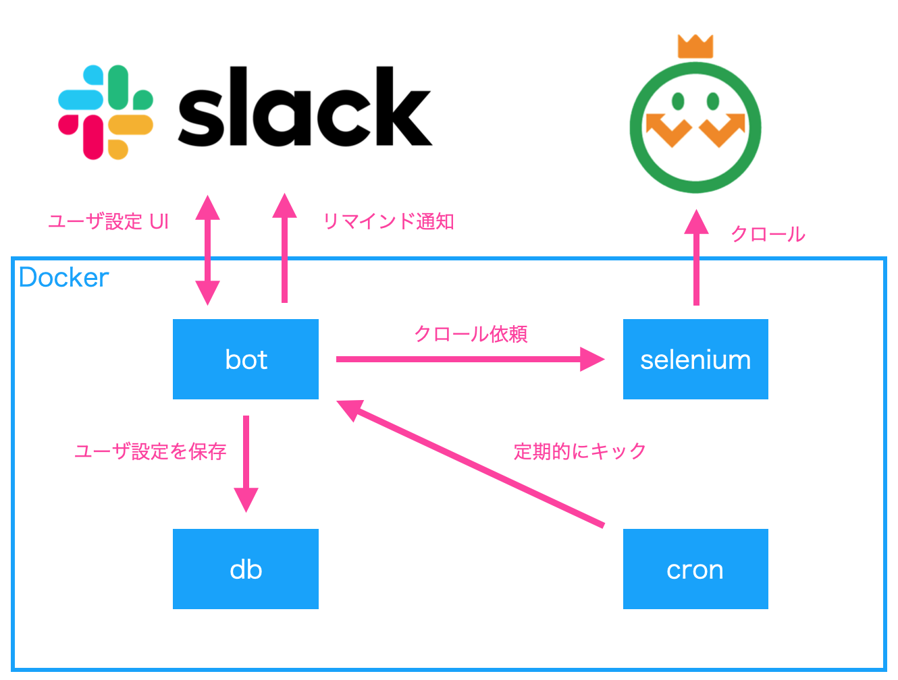

# kin-chan
King of Time リマインダ bot


## 構成


## 環境構築

### Slack Apps
1. 新規 Slack Apps を作成する
  - Interactive Components を有効にする
    - Bot サーバの `/slack/interactive-endpoint` にリクエストが飛ぶように設定する
  - Slash Commands を有効にする
    - Bot サーバの `/slack/command` にリクエストが飛ぶように設定する
  - Bots を有効にする
  - Permissions を設定する
    - Bot Token Scopes に `chat:write` `commands` `users:read` `users:read.email` を追加する
2. ワークスペースにアプリをインストールする

### Bot サーバ
`bot/.env` ファイルを作成し環境変数を設定する。

``` :.env
KINGTIME_ADMIN_USERNAME=...
KINGTIME_ADMIN_PASSWORD=...
SLACK_API_TOKEN=...
SLACK_SIGNING_SECRET=...
```

サーバを起動する。

``` console
$ docker-compose up
```

データベースのテーブルを作成する。

``` console
$ docker-compose exec -T db psql -U postgres < db/schema.sql
```
